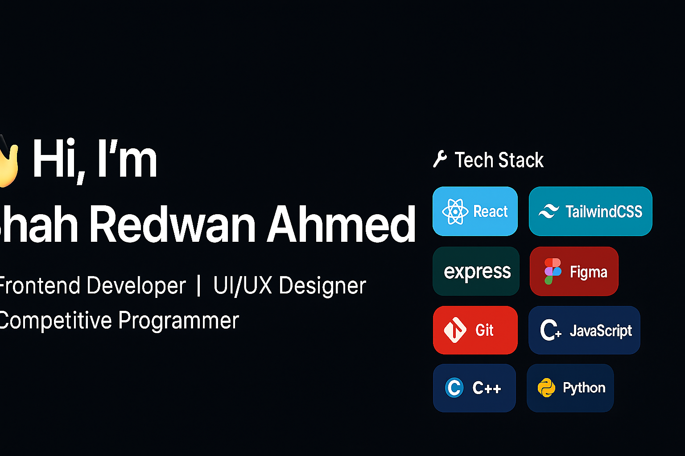

  

🎨 **Frontend Developer** | 💡 **UI/UX Designer** | 🏆 **Competitive Programmer**  

- 🌱 Currently working on: **VillaEase – A room booking platform**  
- 🎯 Focused on: React, TailwindCSS, Rest APIs  
- 🏆 Regular participant in coding contests (HackerRank, Codeforces, LeetCode, CodeChef)  
- 🎨 I also design intuitive UI/UX prototypes in **Figma**  
- 📫 Reach me: [LinkedIn](https://linkedin.com/in/your-link) | [Portfolio (UI/UX)](https://redwan-ui-ux-portfolio.netlify.app) | [Portfolio (Developer)](https://Redwan-Ahmed241.github.io)  
- ⚡ Fun fact: I love creating sleek UI that feels simple but powerful ✨  

---

## 🛠 Tech Stack  

---

## 🚀 Featured Projects  

📌 [**VillaEase – Room Booking App**](#)  
*Full-stack app for managing villas & rooms with admin panel (React + Django)*  

📌 [**UI/UX Portfolio**](https://redwan-ui-ux-portfolio.netlify.app)  
*Collection of my design case studies & prototypes*  

📌 [**Developer Portfolio**](https://Redwan-Ahmed241.github.io)  
*Showcasing my web development projects & coding journey*  

---

## 🏆 Competitive Programming & Certifications  

### 🥇 HackerRank Achievements  
- ⭐⭐⭐⭐⭐ Problem Solving  
- ⭐⭐⭐⭐⭐ C++  

  

---

### 📜 HackerRank Certifications  
- ✅ Problem Solving (Basic)  
- ✅ Problem Solving (Intermediate)  
- ✅ Python (Basic)  
- ✅ JavaScript (Basic)  
- ✅ JavaScript (Intermediate)  
- ✅ SQL (Basic)  
- ✅ CSS (Basic)  
- ✅ Java (Basic)  
- ✅ React (Basic)  

---

## 📊 GitHub Stats  

  
  
  
  

---

## 🌐 Connect with Me  

- Portfolio (UI/UX): [redwan-ui-ux-portfolio.netlify.app](https://redwan-ui-ux-portfolio.netlify.app)  
- Portfolio (Developer): [Redwan-Ahmed241.github.io](https://Redwan-Ahmed241.github.io)  
- HackerRank: [hackerrank.com/RedCodes](https://www.hackerrank.com/RedCodes)  
- LinkedIn: [linkedin.com/in/your-link](https://linkedin.com/in/your-link)  
- Email: **sahmed221241@bscse.uiu.ac.bd**  

---

⭐️ *“Code + Design + Problem Solving = Complete Developer.”*  
